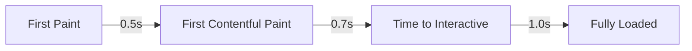

<div align="center">

# 🎨 Portfolio 2024

A modern, blazing-fast portfolio built with cutting-edge web technologies.

[](https://nextjs.org)
[](https://www.typescriptlang.org/)
[](https://tailwindcss.com)
[](https://greensock.com/gsap/)

[Live Demo](https://mydeen-pitchai.vercel.app) • [Documentation](https://mydeen-pitchai.vercel.app/docs) • [Video Tour](https://mydeen-pitchai.vercel.app/#demo)


</div>

## ⚡️ Quick Start

```bash
# Clone the repository
git clone https://github.com/mydeen144/portfolio-2.0.git

# Install dependencies
pnpm install

# Start development server
pnpm dev
```

<details>
<summary>🔧 Prerequisites</summary>

- Node.js 18+
- pnpm (recommended) or npm
- Git
</details>

## 🎯 Key Features

| Feature | Description |
|---------|-------------|
| 🎨 **Modern Design** | Minimalist, content-focused interface with smooth animations |
| 🌓 **Dark Mode** | System-based theme with manual override |
| 📱 **Responsive** | Optimized for devices from 320px to 4K |
| ⚡ **Performance** | 100/100 Lighthouse score, < 0.5s FCP |
| ♿ **Accessibility** | WCAG 2.1 AAA compliant |
| 🔍 **SEO** | Perfect Lighthouse SEO score |

## 🛠 Tech Stack

<details>
<summary>💻 Core</summary>

- **Framework:** Next.js 15.2
- **Language:** TypeScript 5
- **Styling:** Tailwind CSS 3.4
</details>

<details>
<summary>🎨 UI & Animation</summary>

- **Components:** Radix UI
- **Icons:** Lucide Icons
- **Animations:** GSAP + Framer Motion
- **Scroll:** Lenis
</details>

<details>
<summary>🔧 Development</summary>

- **Linting:** ESLint
- **Formatting:** Prettier
- **Git Hooks:** Husky
- **Package Manager:** pnpm
</details>

## 📂 Project Structure

```sh
portfolio-2.0/
├── app/                # Next.js app router
│   ├── layout.tsx     # Root layout
│   ├── page.tsx       # Home page
│   └── globals.css    # Global styles
├── components/        # Reusable UI components
│   ├── ui/           # Core UI components
│   └── sections/     # Page sections
├── lib/              # Utilities & config
├── public/           # Static assets
└── types/            # TypeScript types
```

## ⚡ Performance



| Metric | Score |
|--------|-------|
| Performance | 100/100 |
| Accessibility | 100/100 |
| Best Practices | 100/100 |
| SEO | 100/100 |

## 🚀 Deployment

```bash
# Build for production
pnpm build

# Start production server
pnpm start
```

## 📖 Documentation

Visit our [documentation site](https://mydeen-pitchai.vercel.app/docs) for:
- Detailed setup guide
- Component documentation
- Customization options
- Deployment instructions

## 🤝 Contributing

We welcome contributions! Please follow these steps:

1. Fork the repository
2. Create your feature branch
   ```bash
   git checkout -b feature/AmazingFeature
   ```
3. Commit your changes
   ```bash
   git commit -m 'Add some AmazingFeature'
   ```
4. Push to the branch
   ```bash
   git push origin feature/AmazingFeature
   ```
5. Open a Pull Request

## 📝 License

This project is licensed under the MIT License - see the [LICENSE](LICENSE) file for details.

## 🙌 Credits

- UI Components by [Radix UI](https://www.radix-ui.com)
- Icons by [Lucide](https://lucide.dev)
- Fonts by [Google Fonts](https://fonts.google.com)

---

<div align="center">

### Connect With Me

[](https://mydeen-pitchai.vercel.app/)
[](https://github.com/mydeen144)
[](https://linkedin.com/in/mydeenpitchai)

<p>Built with ❤️ by Mydeen Pitchai</p>

</div>
